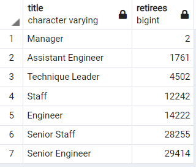
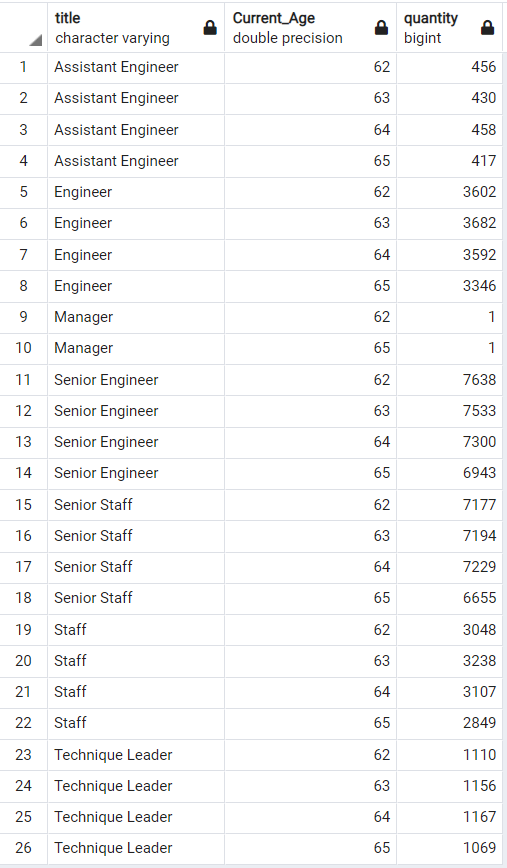
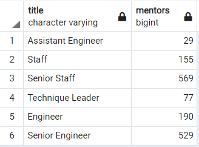
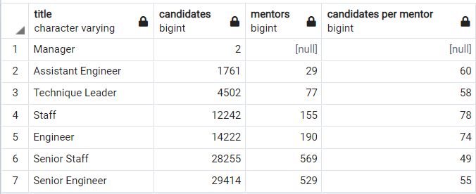

# Pewlett_Hackark_Analysis

## Overview of Project
This project reported the number of potential retirees from 2015 to 2018 and the readiness of Pewlett Hackard to replace the retiring workforce. 

This project focused on following items:
 - **The number of retirees by titles** summarized total potential retirees in each title who were to retire from 2015 to 2018.
 - **The number of retirees by titles and ages** presented the total potential retirees by title and current age. 
 - **The number of internal eligible mentors** summarized the total elibile mentors for each title. 
 - **The number of potential candidates per mentor** calculated the number of candidates each mentor was about to coach to replace the retiring people. 

## Analysis

### The number of retirees by titles

**The number of retirees by titles**

### The number of retirees by titles and ages

**The number of retirees by titles and ages**

### The number of internal eligible mentors

**The number of internal eligible mentors**

### The number of potential candidates per mentor

**The number of potential candidates per mentor**

## Limit

## Conclusion
